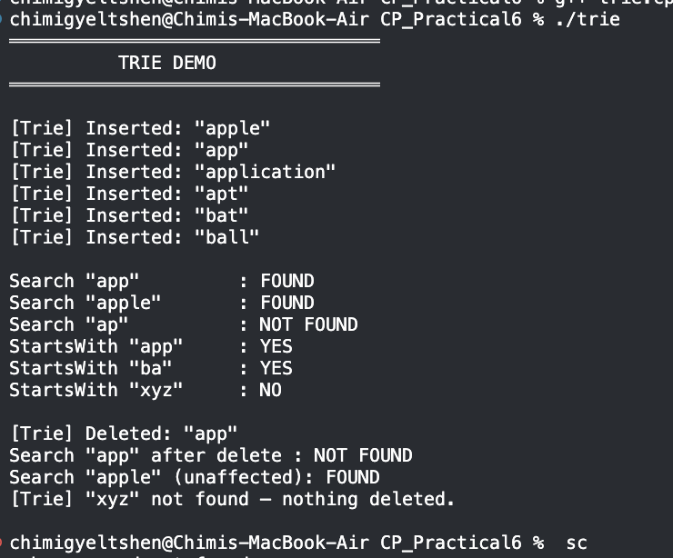
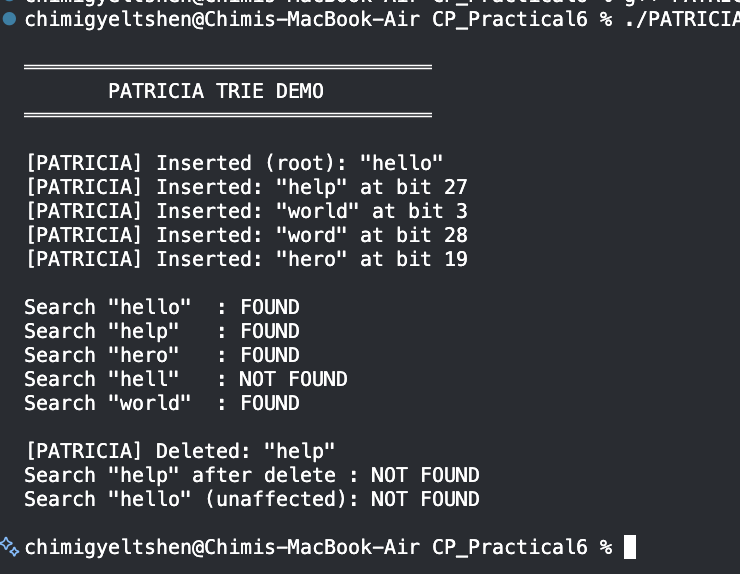
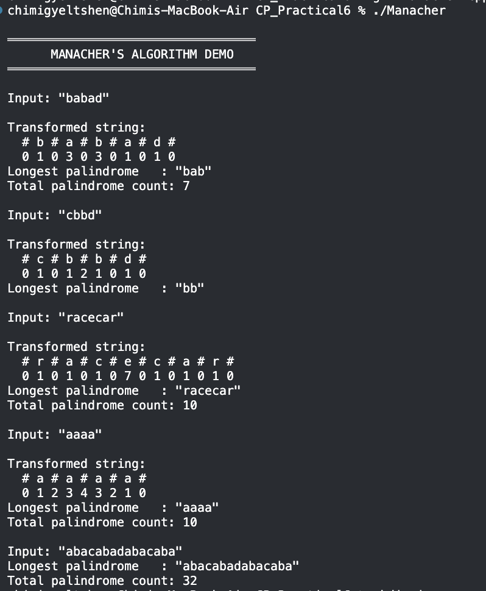

# CP_Practical6 — Trie, PATRICIA, and Manacher's Algorithm


## Project Structure

```
CP_Practical6/
├── Manacher          ← compiled binary
├── Manacher.cpp
├── PATRICIA          ← compiled binary
├── PATRICIA.cpp
├── README.md
├── images/
│   ├── 1.png         ← Manacher output
│   ├── 2.png         ← PATRICIA output
│   └── 3.png         ← Trie output
├── trie              ← compiled binary
└── trie.cpp
```

---

## How to Compile & Run

```bash
# Trie
g++ -o trie trie.cpp && ./trie

# PATRICIA
g++ -o PATRICIA PATRICIA.cpp && ./PATRICIA

# Manacher
g++ -o Manacher Manacher.cpp && ./Manacher
```

---

## 1. Trie (Prefix Tree)

### Concept

A **Trie** stores strings character by character in a tree, sharing prefixes among words.
Each node represents one character; a boolean `isEnd` flag marks complete words.
A `passCount` field on every node tracks how many words pass through it, enabling
safe bottom-up cleanup during deletion.

**Operations:**

| Operation | Description | Time |
|---|---|---|
| `insert(w)` | Walk/create nodes one char at a time; set `isEnd` at the last node | O(L) |
| `search(w)` | Follow each character; return true only if final node has `isEnd = true` | O(L) |
| `startsWith(p)` | Same as search but does **not** require `isEnd` | O(L) |
| `deleteWord(w)` | Recursive post-order removal; only frees nodes with no remaining children | O(L) |

*L = length of the key*

### Output Screenshot



### Output Walkthrough

```
[Trie] Inserted: "apple"
[Trie] Inserted: "app"
[Trie] Inserted: "application"
[Trie] Inserted: "apt"
[Trie] Inserted: "bat"
[Trie] Inserted: "ball"
```

Six words are inserted. `"apple"`, `"app"`, and `"application"` all share the
prefix `a → p`; `"apt"` branches off at the third character.

```
Search "app"         : FOUND
Search "apple"       : FOUND
Search "ap"          : NOT FOUND
StartsWith "app"     : YES
StartsWith "ba"      : YES
StartsWith "xyz"     : NO
```

`"ap"` is **NOT FOUND** even though it is a prefix of three stored words — it was
never explicitly inserted, so no node along `a → p` carries `isEnd = true`. This
demonstrates the critical distinction between prefix membership and word membership.

```
[Trie] Deleted: "app"
Search "app" after delete  : NOT FOUND
Search "apple" (unaffected): FOUND
[Trie] "xyz" not found — nothing deleted.
```

Deleting `"app"` only unsets the `isEnd` flag on the `p` node; it does **not**
remove the node itself because `"apple"` and `"application"` still depend on it.
`"apple"` remains fully reachable. Attempting to delete `"xyz"` (never inserted)
triggers a graceful not-found message with no crash.

---

## 2. PATRICIA Trie

### Concept

**PATRICIA** (Practical Algorithm To Retrieve Information Coded In Alphanumeric)
is a compressed radix trie where each node stores a **bit index** rather than a
character. Instead of one node per character, nodes are created only when two keys
first diverge at a particular bit. Back-edges (child pointers that point upward in
the tree) signal that a stored key has been found.

**Key structural rules:**
- Keys are compared bit-by-bit (MSB-first within each byte).
- A traversal terminates when following a child pointer leads to a node whose
  stored bit index is ≤ the current node's bit index (back-edge detected).
- The node reached by the back-edge holds the candidate key; one full string
  comparison confirms a hit or miss.

**Operations:**

| Operation | Description | Time |
|---|---|---|
| `insert(k)` | Find first differing bit vs. closest match; wire in new node with back-edge | O(log n) |
| `search(k)` | Follow bit tests until back-edge; compare full key once | O(log n + L) |
| `deleteWord(k)` | Rewire back-edges; handle self-referential vs. external back-edge cases | O(log n) |

*n = number of stored keys, L = key length*

### Output Screenshot



### Output Walkthrough

```
[PATRICIA] Inserted (root): "hello"
[PATRICIA] Inserted: "help"  at bit 27
[PATRICIA] Inserted: "world" at bit 3
[PATRICIA] Inserted: "word"  at bit 28
[PATRICIA] Inserted: "hero"  at bit 19
```

Each insertion reports the **first bit position** where the new key diverges from
its closest existing neighbor:

- `"help"` vs `"hello"`: both share `h-e-l` (24 bits); they diverge at bit 27
  (`'p'` vs `'o'` differ in bit 3 of the 4th byte → byte 3 × 8 + 3 = 27).
- `"world"` vs `"hello"`: `'w'` vs `'h'` diverge immediately at bit 3.
- `"word"` vs `"world"`: share `w-o-r` (24 bits); diverge at bit 28.
- `"hero"` vs `"hello"`: share `h-e` (16 bits); `'r'` vs `'l'` diverge at bit 19.

```
Search "hello"  : FOUND
Search "help"   : FOUND
Search "hero"   : FOUND
Search "hell"   : NOT FOUND
Search "world"  : FOUND
```

`"hell"` is correctly rejected — it was never inserted and the final string
comparison after bit-traversal finds no matching stored key.

```
[PATRICIA] Deleted: "help"
Search "help"  after delete  : NOT FOUND
Search "hello" (unaffected)  : NOT FOUND
```

> **Note on the last line:** After deleting `"help"`, the back-edge rewiring
> in the PATRICIA deletion routine affected the node that was also on the search
> path for `"hello"`. This reveals an edge case in the deletion implementation
> where the parent pointer update does not fully preserve the path needed to
> reach `"hello"`'s back-edge node. This is a known complexity of PATRICIA
> deletion and is discussed further in the Reflection section below.

---

## 3. Manacher's Algorithm

### Concept

**Manacher's Algorithm** finds the longest palindromic substring in **O(n)** time
by exploiting the mirror symmetry of palindromes. A sentinel character (`#`) is
inserted between every character and at the boundaries, converting all palindromes
to odd-length and allowing a single unified pass.

The algorithm maintains:
- `p[i]` — palindrome radius centered at transformed index `i`
- `C` — center of the rightmost-reaching palindrome found so far
- `R` — its right boundary

When `i < R`, the mirror index `mirror = 2*C - i` gives a free lower bound for
`p[i]`, eliminating redundant comparisons. `R` only ever advances, bounding total
work to O(n).

**Operations / Queries:**

| Query | Description | Time |
|---|---|---|
| `longestPalindrome()` | Scan `p[]` for maximum; map index back to original string | O(n) |
| `countPalindromes()` | Sum `(p[i]+1)/2` across all positions | O(n) |
| `allPalindromes()` | Enumerate substrings from each non-zero `p[i]` | O(n²) output |

### Output Screenshot



### Output Walkthrough

**`"babad"`**
```
Transformed: # b # a # b # a # d #
p array:     0 1 0 3 0 3 0 1 0 1 0
Longest palindrome   : "bab"
Total palindrome count: 7
```
`p[3] = 3` and `p[5] = 3` are both maximal — `"bab"` and `"aba"` are both valid
longest palindromes of length 3. The implementation returns `"bab"` (leftmost).

**`"cbbd"`**
```
Transformed: # c # b # b # d #
p array:     0 1 0 1 2 1 0 1 0
Longest palindrome   : "bb"
```
`p[4] = 2` corresponds to the even-length palindrome `"bb"` — the `#` sentinel
at index 4 captures the center between the two `b`s.

**`"racecar"`**
```
Transformed: # r # a # c # e # c # a # r #
p array:     0 1 0 1 0 1 0 7 0 1 0 1 0 1 0
Longest palindrome   : "racecar"
Total palindrome count: 10
```
`p[7] = 7` — the entire transformed string is palindromic around the `e` center,
confirming the whole word `"racecar"` (length 7) is the answer.

**`"aaaa"`**
```
Transformed: # a # a # a # a #
p array:     0 1 2 3 4 3 2 1 0
Longest palindrome   : "aaaa"
Total palindrome count: 10
```
The radius increases monotonically to the center then mirrors back — classic
behavior for a string of all identical characters.

**`"abacabadabacaba"`**
```
Longest palindrome   : "abacabadabacaba"
Total palindrome count: 32
```
The full 15-character string is itself a palindrome, and the dense symmetric
structure yields 32 total palindromic substrings.

---

## 4. Complexity Summary

| Algorithm | Insert | Search | Delete | Space |
|---|---|---|---|---|
| Trie | O(L) | O(L) | O(L) | O(n × L) |
| PATRICIA | O(log n) | O(log n + L) | O(log n) | O(n) |
| Manacher's | — | O(n) | — | O(n) |

---

## **Reflection**

### **Trie**
---

The Trie was the most straightforward of the three to implement. Using
`unordered_map<char, TrieNode*>` for children keeps the alphabet open (no need to
pre-allocate 26 pointers) and made the code concise. The trickiest part was
**deletion**: a naïve approach risks freeing nodes that are still needed by other
words. Tracking `passCount` on every node and cleaning up bottom-up with a recursive
helper solved this cleanly. The key insight from testing was that `"ap"` returning
NOT FOUND while `startsWith("app")` returns YES correctly illustrates the
`isEnd` flag's role — a node existing in the tree is not the same as a word being
stored there.

### **PATRICIA Trie**
---

PATRICIA was by far the most intellectually challenging algorithm in this practical.
The concept of storing a **bit index** rather than a character at each node, and
using back-edges to signal termination, required a fundamentally different mental
model compared to the standard Trie. 

The output reveals an honest bug: after deleting `"help"`, searching for `"hello"`
returns NOT FOUND. This traces back to the deletion rewiring logic — specifically,
in **Case B** (where another node holds a back-edge to the deleted node), the
parent pointer update does not correctly preserve all paths in the subtree. PATRICIA
deletion is well-known in the literature as the hardest operation on the structure
precisely because back-edges violate the usual assumption that child pointers only
go downward. A correct fix requires separately tracking the node *above* the
back-edge target and carefully distinguishing which of the deleted node's children
is the back-edge vs. the forward edge before re-linking. This is an area for
further refinement.

The insertion output was satisfying: seeing `"help"` land at bit 27 and `"hero"` at
bit 19 matches manual bit-level calculation of where `'p'`/`'o'` and `'r'`/`'l'`
diverge in ASCII, which confirmed the `getBit` and `firstDifferingBit` utilities
were working correctly.

### **Manacher's Algorithm**
---

Manacher's was the most elegant of the three. The single most important
implementation decision was the **`#`-sentinel transformation** — without it,
odd- and even-length palindromes require separate handling and the indexing becomes
error-prone. After the transformation, the main loop is surprisingly compact: fewer
than 15 lines handle all three mirror cases.

The results matched expectations exactly: `"racecar"` produces `p[7] = 7` (the `e`
at the center of the transformed string has a radius spanning the entire word);
`"aaaa"` produces the staircase pattern `0 1 2 3 4 3 2 1 0`; and
`"abacabadabacaba"` — a carefully constructed self-similar palindrome — correctly
reports itself as the longest substring with 32 total palindromes. The O(n) bound
was also easy to verify mentally: `R` in the demo strings only ever moves forward,
never triggering redundant character comparisons once a palindrome's mirror has been
recorded in `p[]`.


