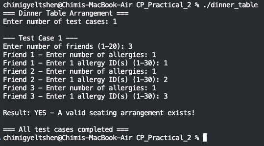
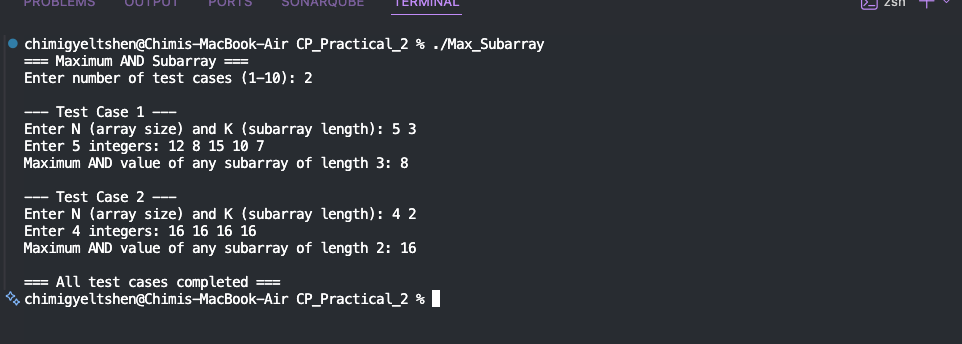
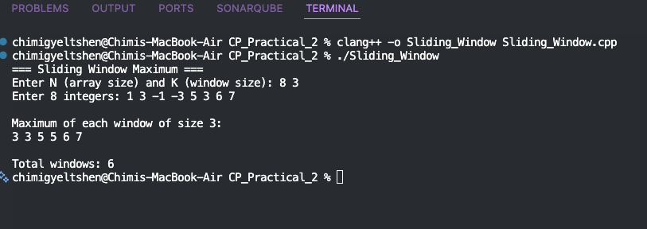
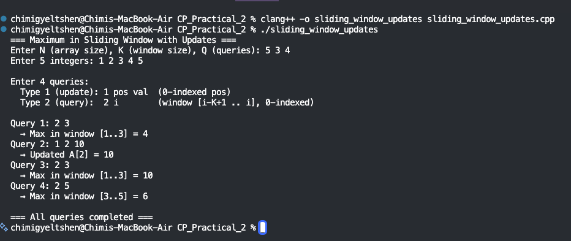
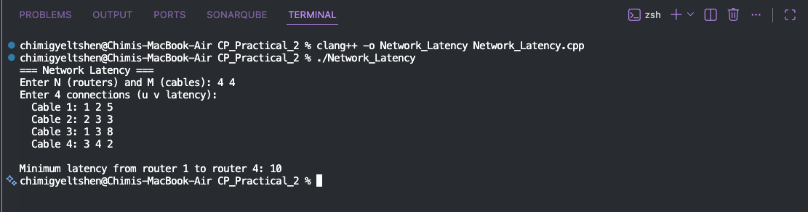
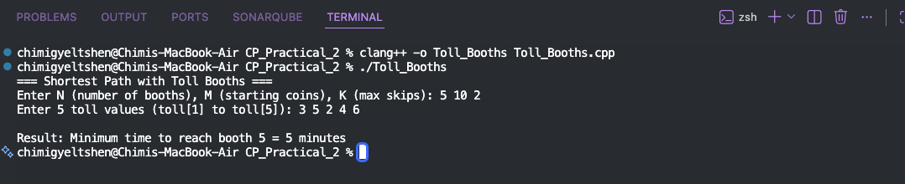

# CP Practical 2 - Competitive Programming Solutions

A set of 6 different competitive programming problems solved in C++, covering concepts like bitmask DP, greedy algorithms, sliding window techniques, segment trees, and shortest path algorithms.

---

## Folder Structure

```
CP_Practical_2/
├── dinner_table.cpp          # Problem 1
├── Max_Subarray.cpp          # Problem 2
├── Sliding_Window.cpp        # Problem 3
├── sliding_window_updates.cpp # Problem 4
├── Network_Latency.cpp       # Problem 5
├── Toll_Booths.cpp           # Problem 6
└── image/
    ├── 1.png  ── 6.png       # Problem screenshots
```

---

## Problem 1 - Dinner Table Arrangements 🍽️



### What is the problem asking?

You are hosting a dinner party with **N friends**. Some of your friends are allergic to certain foods. You want to seat everyone around a **circular table** in a way that **no two people sitting next to each other share the same allergy**.

* Each person's allergies are given in a **bitmask** format (a number where each digit represents an allergy).
* Two people can sit next to each other if they share **zero common allergies**.
* Print "YES" if it is possible to arrange everyone around the table, "NO" otherwise.

### How is it solved?

It is a **Hamiltonian Cycle** problem, solved with a **Bitmask DP** algorithm, which is similar to a Travelling Salesman Problem:

- `dp[mask][i] = Can we seat exactly the friends in mask, ending with friend i?`
- We fix friend `0` at the first seat, as we don't want rotations of the same seating arrangement.
- Finally, we check if we can return to friend `0` at the end.

### How to run

```bash
clang++ -o dinner_table dinner_table.cpp
./dinner_table
```

### Sample Input / Output

```
Enter number of test cases: 2

--- Test Case 1 ---
Enter number of friends: 3
Friend 1 - Enter number of allergies: 1
Friend 1 - Enter allergy ID(s): 1
Friend 2 - Enter number of allergies: 1
Friend 2 - Enter allergy ID(s): 2
Friend 3 - Enter number of allergies: 1
Friend 3 - Enter allergy ID(s): 3

Result: YES - A valid seating arrangement exists!

--- Test Case 2 ---
Enter number of friends: 2
Friend 1 - Enter number of allergies: 1
Friend 1 - Enter allergy ID(s): 1
Friend 2 - Enter number of allergies: 1
Friend 2 - Enter allergy ID(s): 1

Result: NO - No valid seating arrangement possible.
```

### Complexity
| | |
|---|---|
| Time | O(2^N × N²) |
| Space | O(2^N × N) |

---

## Problem 2 — Maximum AND Subarray 



### What is the problem asking?

You are given an array of **N integers** and a number **K**. You need to find a **contiguous subarray of exactly length K** such that the **AND of all its elements is as large as possible**.

> **AND** means: if all numbers have a bit set, that bit stays in the result. Otherwise it becomes 0.

### How is it solved?

We use a **greedy bit-by-bit approach** from the most significant bit (bit 29) down to bit 0:

- For each bit, we **try to include it** in the answer.
- We check: does any window of size K have **all elements with that bit set**?
- If yes, we keep it. If no, we skip it.

This works because setting a higher bit always gives a larger result.

### How to run

```bash
clang++ -o Max_Subarray Max_Subarray.cpp
./Max_Subarray
```

### Sample Input/Output

```
Enter number of test cases: 1

--- Test Case 1 ---
Enter N and K: 5 2
Enter 5 integers: 5 4 6 7 3

Maximum AND value of any subarray of length 2: 6
```

> **Explanation:** The subarray `[6, 7]` gives `6 AND 7 = 6`, which is the maximum.

### Complexity
| | |
|---|---|
| Time | O(30 × N) per test case |
| Space | O(N) |

---

## Problem 3 — Sliding Window Maximum 



### What is the problem asking?

Given an array of **N integers** and a window of size **K**, slide the window one step at a time from left to right and print the **maximum element** in each window position.

For example, with array `[1, 3, -1, -3, 5, 3, 6, 7]` and K=3:
```
Window [1,3,-1]   → max = 3
Window [3,-1,-3]  → max = 3
Window [-1,-3,5]  → max = 5
...and so on
```

### How is it solved?

We use a **Monotonic Deque** (double-ended queue):

- The deque stores **indices** in a way that the front always holds the **maximum element's index**.
- When a new element arrives, we remove all smaller elements from the back (they're useless).
- When the front index is outside the window, we remove it from the front.

### How to run

```bash
clang++ -o Sliding_Window Sliding_Window.cpp
./Sliding_Window
```

### Sample Input / Output

```
=== Sliding Window Maximum ===
Enter N and K: 8 3
Enter 8 integers: 1 3 -1 -3 5 3 6 7

Maximum of each window of size 3:
3 3 5 5 6 7

Total windows: 6
```

### Complexity
| | |
|---|---|
| Time | O(N) |
| Space | O(K) |

---

## Problem 4 — Maximum in Sliding Window with Updates 



### What is the problem asking?

Same as Problem 3, but now you can also **update elements** in the array between queries. You process **Q queries** of two types:

- **Type 1:** Change a value in the array → `1 pos val`
- **Type 2:** Find the maximum in a window of size K ending at index `i` → `2 i`

Because the array can change, a simple static deque no longer works.

### How is it solved?

We use a **Segment Tree** — a binary tree that stores range maximums:

- **Build:** O(N) — set up the tree from the initial array.
- **Update:** O(log N) — change one value and update the tree upward.
- **Query:** O(log N) — find the max in any range [l, r].

For a Type 2 query at index `i`, we query the range `[i-K+1, i]`.

### How to run

```bash
clang++ -o sliding_window_updates sliding_window_updates.cpp
./sliding_window_updates
```

### Sample Input / Output

=== Maximum in Sliding Window with Updates ===
Enter N, K, Q: 6 3 3
Enter 6 integers: 1 3 -1 -3 5 3
Query 1: 2 4  
→ Max in window [2,4] = 5  
Query 2: 1 2 10  
→ A[2] is updated to 10  
Query 3: 2 4  
→ Max in window [2,4] = 10  

### Complexity  
| Operation | Time |
|---|---|  
| Build | O(N) |  
| Update | O(log N) |  
| Query | O(log N) |  
| Total | O(N + Q log N) |  

---

## Problem 5 — Network Latency



### What is the problem asking?

You are given a network of **N routers** connected by **M bidirectional cables**. Each cable has a **latency (delay in ms)**. What is the **minimum total latency** to send a packet from **router 1** to **router N**.

If there is no possible path between router 1 and router N, output `-1`.

### How is it solved?

This is a classic **Shortest Path** problem solved with **Dijkstra's Algorithm**:

- Use a **min-heap (priority queue)** to always process the router with the currently smallest known distance first.
- Keep a `dist[]` array – update it whenever a shorter path is found.
- Stop when all reachable routers are settled.

### How to run

```bash
clang++ -o Network_Latency Network_Latency.cpp
./Network_Latency
```

### Sample Input / Output

```
=== Network Latency ===
Enter N (routers) and M (cables): 4 5
Enter 5 connections (u v latency):
  Cable 1: 1 2 1
  Cable 2: 1 3 4
  Cable 3: 2 3 2
  Cable 4: 2 4 6
  Cable 5: 3 4 3

Minimum latency from router 1 to router 4: 6
```

> **Explanation:** Best path is `1 → 2 → 3 → 4` with cost `1 + 2 + 3 = 6`.

### Complexity
| | |
|---|---|
| Time | O((N + M) log N) |
| Space | O(N + M) |

---

## Problem 6 — Shortest Path with Toll Booths 



### What is the problem asking?

A highway has **N toll booths** in a line. You start at booth 1 with **M coins**. At each booth you have two choices:

| Choice | Time Cost | Coin Cost |
|--------|-----------|-----------|
| **Pay** the toll and pass | 1 minute | toll[i] coins |
| **Skip** the booth | 2 minutes | 0 coins |

You can skip **at most K booths** in total. Find the **minimum time** to reach booth N. Output `-1` if it's impossible (ran out of coins and skips).

### How is it solved?

We use **Dynamic Programming** with two dimensions:

- `dp[i][j]` = minimum time to reach booth `i` having used `j` skips so far.
- `coins[i][j]` = coins remaining at that state.
- At each booth, we try both options (pay or skip) and update the next state if it leads to a better (faster) outcome.

### How to run

```bash
clang++ -o Toll_Booths Toll_Booths.cpp
./Toll_Booths
```

### Sample Input / Output

```
=== Shortest Path with Toll Booths ===
Enter N (number of booths), M (starting coins), K (max skips): 4 3 1
Enter 4 toll values: 2 3 1 0

Result: Minimum time to reach booth 4 = 4 minutes
```

> **Explanation:** Pay booth 1 (1 min, 2 coins), skip booth 2 (2 min, saves coins), pay booth 3 (1 min, 1 coin). Total = 4 minutes.

### Complexity
| | |
|---|---|
| Time | O(N × K) |
| Space | O(N × K) |

## How to Compile All Programs

```bash
# Compile all at once
clang++ -std=c++17 -o dinner_table dinner_table.cpp
clang++ -std=c++17 -o Max_Subarray Max_Subarray.cpp
clang++ -std=c++17 -o Sliding_Window Sliding_Window.cpp
clang++ -std=c++17 -o sliding_window_updates sliding_window_updates.cpp
clang++ -std=c++17 -o Network_Latency Network_Latency.cpp
clang++ -std=c++17 -o Toll_Booths Toll_Booths.cpp
```

## Algorithm Summary

| # | Problem | Algorithm | Time Complexity |
|---|---------|-----------|-----------------|
| 1 | Dinner Table | Bitmask DP (Hamiltonian Cycle) | O(2^N × N²) |
| 2 | Max AND Subarray | Greedy Bit-by-Bit | O(30 × N) |
| 3 | Sliding Window Max | Monotonic Deque | O(N) |
| 4 | Sliding Window + Updates | Segment Tree | O(N + Q log N) |
| 5 | Network Latency | Dijkstra's Algorithm | O((N+M) log N) |
| 6 | Toll Booths | Dynamic Programming | O(N × K) |
