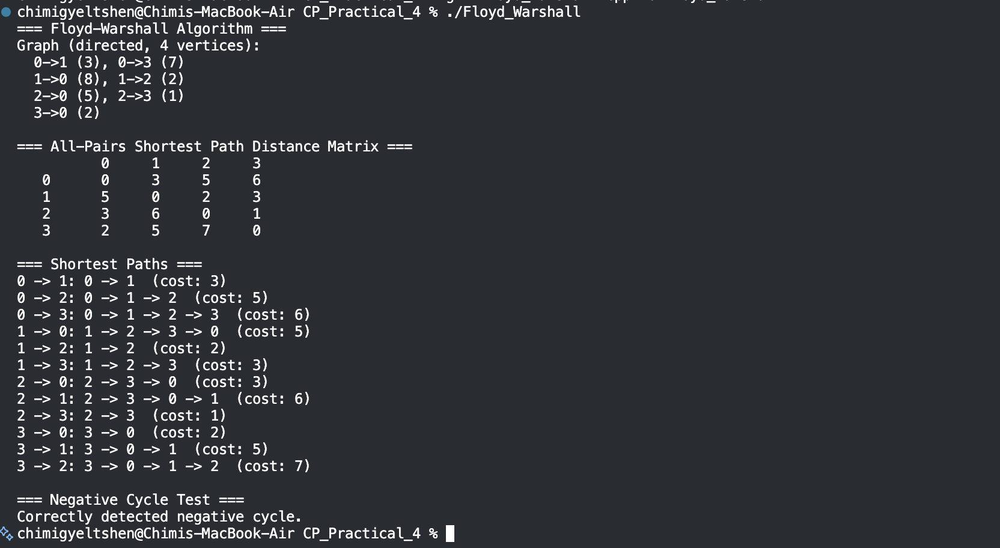
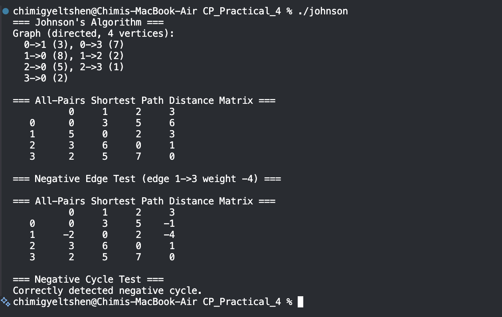
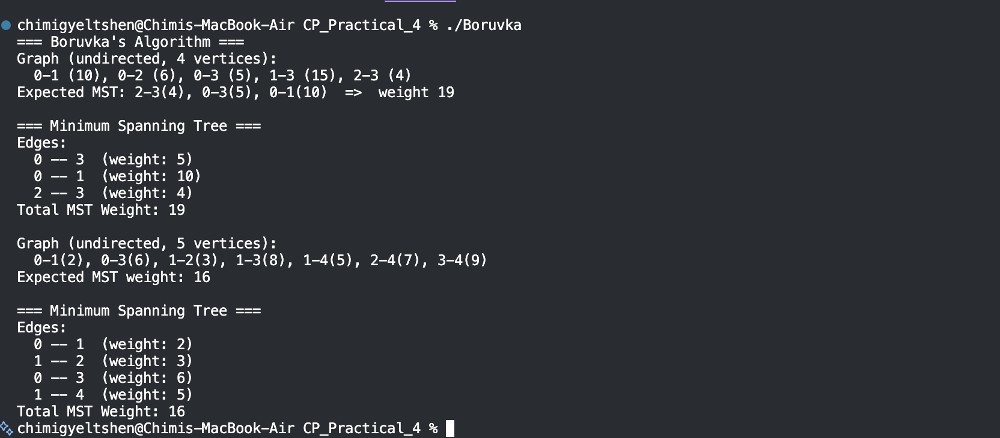

# Graph Algorithms: Floyd-Warshall, Johnson's, Borůvka's

## Overview

This project implements the following classical graph algorithms in C++, each in a separate header file: 

- **Floyd-Warshall** algorithm for solving the **All-Pairs Shortest Paths** problem.
- **Johnson's** algorithm, which uses the **Disjoint Set Union** data structure in addition to Dijkstra's algorithm, to solve the **All-Pairs Shortest Paths** problem.
- **Borůvka's** algorithm, which uses the **Disjoint Set Union** data structure, to solve the **Minimum Spanning Tree** problem.

---

## File Structure

```
.
├── floyd_warshall.cpp   # Floyd-Warshall algorithm implementation
├── johnson.cpp        # Johnson's algorithm implementation
├── boruvka.cpp        # Borůvka's algorithm implementation
└── README.md
```

## How to Compile and Run

```bash
g++ Boruvka.cpp -o Boruvka
./algorithms
```

---

## Algorithm Breakdown

### 1. Floyd-Warshall Algorithm (`floyd_warshall.h`)

**Problem:** All-Pairs Shortest Paths in a directed weighted graph.

**Idea:** The algorithm uses the dynamic programming technique, which is based on the following observation: _"The shortest path from vertex i to vertex j exists either via an intermediate vertex k or it doesn’t."_

```
dist[i][j] = min(dist[i][j], dist[i][k]+dist[k][j])
```

**What I understood:** The order of loops is important, and the outer loop should be over k, not i or j. The code was originally written with an incorrect order, and this led to wrong results. The proof for correctness is based on the fact that for an intermediate node k, `dist[i][k]` and `dist[k][j]` are already optimal for all intermediate nodes `{0, 1, ... k-1}`.

I also included **path reconstruction** and a `next[][]` matrix, which is used to determine the next node to visit on the shortest path, obtained through the relaxation and recursive search process.

**Negative Cycle Detection:** After the execution of the algorithm, if `dist[i][i]` is found to be negative for a node `i`, then that node is a part of a negative cycle.



| **Property** | **Value** | | --- | --- | | **Time Complexity** | O(V³) | | **Space Complexity** | O(V²) | | **Handles Negative Edges** | ✅ **Yes** | | **Handles Negative Cycle** | ✅ **Detected** | | **Best for** | Dense Graphs, Small V |

### 2. Johnson's Algorithm (`johnson.h`)

**Problem:** All Pairs Shortest Paths — intended to be more efficient than Floyd Warshall on **sparse** graphs.

**Basic Idea:** Johnson's algorithm is a two-step algorithm:

1. **Reweighting using Bellman-Ford:** Introduce a new source node q with edges to all nodes with weight 0 and run Bellman-Ford on the graph to get the potential values `h[v]`. Now we can reweight the edges:
   ```c
   w'(u, v) = w(u, v) + h[u] - h[v]
   ```
   This ensures that the re-weighted graph has non-negative edges.
2. **Dijkstra's on the re-weighted graph:** Since we've got a non-negative weight graph now, we can use Dijkstra on the graph to find the shortest paths:
   ```c
   dist(s, v) = d'(s, v) + h[v] - h[s]
   ```

   

**What I understood:** The reweighting trick is the genius part. At first, I was not sure _why_ `w'(u, v) = w(u, v) + h[u] - h[v]` is supposed to preserve shortest paths. The answer is that the sum over `h[u] - h[v]` is telescoping, and the sum over all paths reduces to `h[s] - h[t]`, which is constant and depends only on `s` and `t`.

The virtual source trick, setting `h[v] = 0` for all vertices, is valid because we need the potential `h` to take into account the "reachability" of each `v` from the entire graph. Johnson's algorithm handles negative edges, but not negative cycles (which are handled by Bellman-Ford).

| Property                | Value                  |
| ----------------------- | ---------------------- |
| Time Complexity         | O(V² log V + VE)       |
| Space Complexity        | O(V + E)               |
| Handles negative edges  | ✅ Yes                 |
| Handles negative cycles | ✅ Detected            |
| Best for                | Sparse graphs, large V |

---

### 3. Borůvka's Algorithm (`boruvka.h`)

**Problem:** Finding the Minimum Spanning Tree (MST) of a given undirected weighted graph.

**Core Idea:** Initialize all vertices as separate components. Iteratively find **the cheapest edge from each component** and add them to the MST. This process takes **at most log V** phases, where V is the number of vertices, since we reduce the **number of components** by at least half in each phase.

**What I understand from this algorithm:** Borůvka's algorithm was the first algorithm for finding MST, introduced by Otakar Borůvka in 1926, even before Kruskal's and Prim's algorithms. The most interesting thing about Borůvka's algorithm, from what I understand, is its **parallel nature** and its **potential use in parallel processing**.

**What I think:** The DSU data structure plays a vital role in Borůvka's algorithm, and I implemented it with **path compression** and **union by rank** to ensure **constant time** for each **find** and **union** operation. Without DSU, we would take **linear time** to check whether two nodes belong to the same component or not.

One important note is that in each stage, more than one edge might be selected independently. This is taken care of by the check `dsu.find(u) != dsu.find(v)` to merge edges. If two components have already selected each other's cheapest edges, no merge is performed.

| Property         | Value                    |
| ---------------- | ------------------------ |
| Time Complexity  | O(E log V)               |
| Space Complexity | O(V + E)                 |
| Graph type       | Undirected, weighted     |
| Best for         | Parallel/distributed MST |



---

## Key Takeaways

- **Floyd-Warshall** is the preferred choice when the graph is dense and V is small (V ≤ ~500). Its simplicity ensures correctness.
- **Johnson's** is best when the graph is very large and sparse. The time saved with Dijkstra V times over the O(V³) cubic time complexity is significant.
- **Borůvka's** is the oldest of the three and perhaps the most "parallel-friendly" MST algorithm. Learning about it also gave me a deeper understanding of why Kruskal's and Prim's algorithms are the way they are.

